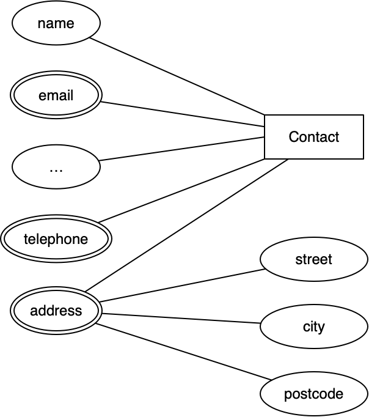
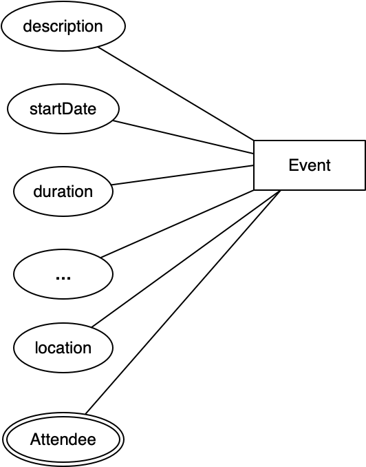
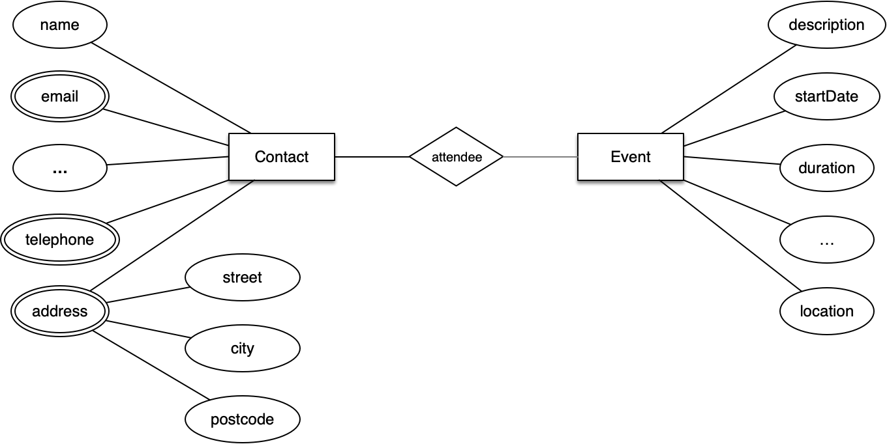

***************
Voorbeeld-model
***************

Als NoSQL/MongoDB-voorbeeld gebruiken we een *contacten*-database.
Deze zou je kunnen gebruiken voor een contacten-toepassing,
zoals je die bijvoorbeeld op een smartphone gebruikt.

Later breiden we deze uit met *events*, als onderdelen van een agenda-toepassing.
Deze events kunnen we dan koppelen aan contacten,
bijvoorbeeld voor de personen die deelnemen in een afspraak.

Contacten
=========

Contact-records (of Contact-*documenten*, in MongoDB-termen) kunnen sterk verschillen in de gegevens die deze bevatten.
Van de ene persoon weet je niet veel meer dan de naam en het telefoonnummer,
van een ander weet je ook het huisadres, werkadres, enz.
Dit sluit goed aan bij de mogelijkheden van MongoDB,
waar elk document zijn eigen structuur ("schema") beschrijft.

  In een relationele database is een dergelijke variatie lastig.
  Je kunt bijvoorbeeld niet gemakkelijk voor het ene contact 1 telefoonnummer opslaan,
  en voor het andere 3. (En misschien heb je later nog meer nodig.)

Enkele voorbeelden van contact-documenten:

.. code-block:: json

  {"name": "Leontien de Bruin ",
   "email":
   ["lhmdebruin@hotmail.com",
    "leontien134@tiscalimail.nl"
   ],
   "address": {"street": "Tulpstraat 17",
               "city": "Amsterdam"}
  }

.. code-block:: json

  {"name": "Hans de Boer",
   "email": "hdb@example.com",
   "tel": "06-1290 8746"
  }

Een E-R-model
=============

Je kunt een contact beschrijven met een Entity-Relationship-model.
In de UML-notatie krijg je dan zoiets al de onderstaande figuur.

  E-R model voor Contact

De attributen van de entity ``Contact`` zijn ``name``, ``email``, ``telephone``, en ``address``.
Deze laatste is een samengesteld attribuut, met onder andere het straatadres, de plaats en de postcode.
Er kunnen later nog (veel) meer attributen toegevoegd worden,
bijvoorbeeld ``birthDate`` of ``partner``.

Let op de dubbele rand bij ``email`` en ``address``:
deze geeft aan dat een contact meerdere email-adressen en fysieke adressen kan hebben.

Merk op dat dit model nog niet beschrijft wat de types van de attribuut-waarden zijn.

In dit geval gebruiken we nog geen *relaties* tussen verschillende documenten:
een document bevat alle gegevens van een contact.

  Later kun je dit uitbreiden, bijvoorbeeld met relaties als: `partner`, `employer`, e.d.,
  die verwijzen naar andere contacten.

Zoals je later zult zien, kun je dit model direct omzetten in het bijbehorende MongoDB-document.
In het bijzonder kun je daar ook samengestelde attributen opnemen,
en meerwaardige (*multivalued*) attributen.

Events
======

In een volgende stap combineren we deze contacten met *events* voor een agenda-toepassing.
Een *event* is hier een afspraak in een agenda.
Een *event* kan een aantal *deelnemers* hebben;
deze vinden we dan weer terug in de contacten.

Ook een *event* kan nog meer attributen hebben dan hier vermeld.

  E-R model voor Event

Voorbeeld van een *event*:

.. code-block:: json

  {"subject": "Beleidsplan",
   "time": {"$date": "2019-04-13T00:00:00.000Z"},
   "duration": 120,
   "participants": [{ "email": "gijsbkom@ziggo.nl"},
                    {"email": "a34huis@gmail.com"} ],
   "location": "Amsterdam Zuid"
  }

Gecombineerd model
==================

In het gecombineerde model geven we de *relatie* tussen `Contact` en `Event` aan:

  E-R model met Contact-Event relatie

De notatie van de relatie met de dubbele lijn geeft aan dat dit een meervoudige relatie is:

  Bij E-R modelleren gebruik je vaak werkwoorden voor relaties (en attributen).
  In plaats van over ``participant`` spreek je dan over ``participates in``.

.. todo::

  De naamgeving van de attributen is nog niet consistent,
  in het model en in de implementatie.
  Voor *events* zijn er twee soorten globale schema's:
  xCal, het uitwisselingsformaat voor iCal (en andere kalendersystemen);
  en Event van schema.org.

  * xCal: Summary en (uitgebreider) Description; daarnaast Attendee en Organizer.
  * Event: Name en (uitgebreider) Description.

Over adressen
-------------

In het bovenstaande model is een adres geen zelfstandige *entity*,
maar een attribuut van een *Contact*.
In andere domeinen zal dit wel het geval zijn,
bijvoorbeeld bij het kadaster en de gemeente.
Daar wil je allerlei extra gegevens over adressen kunnen bewaren,
en adressen als zelfstandige *entities* kunnen benaderen,
niet (alleen) als attribuut van een andere entity.

Dit maakt duidelijk dat het model sterk afhangt van het domein waarin dit model gebruikt wordt.

In onze toepassing kun je een adres mogelijk ook als zelfstandige entity invoeren,
bijvoorbeeld als je de agenda/contact-toepassing wilt combineren met navigatie.
